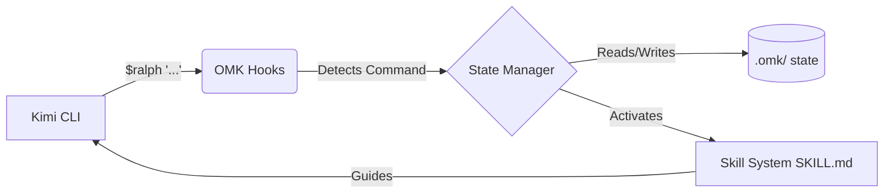

<div align="center">

# 🚀 oh-my-kimi (OMK)

**The Ultimate Workflow Orchestration Layer for [Kimi Code CLI](https://moonshotai.github.io/kimi-cli/)**

[](https://www.npmjs.com/package/oh-my-kimi)
[](https://github.com/Goblin1024/oh-my-kimi/blob/main/LICENSE)
[](https://github.com/Goblin1024/oh-my-kimi/stargazers)
[](http://makeapullrequest.com)

*Bring structured agentic workflows, team collaboration, and persistent execution to your AI coding sessions.*

[English](./README.md) • [简体中文](./README.zh-CN.md) • [Documentation](docs/GETTING-STARTED.md)

</div>

---

## ✨ Why oh-my-kimi?

**oh-my-kimi (OMK)** supercharges your [Kimi Code CLI](https://moonshotai.github.io/kimi-cli/) experience. While Kimi serves as a powerful execution engine, OMK adds the missing layer of **structured workflows, intelligent state management, and reusable agent skills**.

Stop prompting from scratch every time. Start building with a proven system.

### 🌟 Core Capabilities

*   🧠 **Start Stronger:** Begin every session with deeply contextualized guidance.
*   🛤️ **Consistent Workflows:** Follow the canonical path from idea to code: `$deep-interview` ➔ `$ralplan` ➔ `$ralph`.
*   🛠️ **Canonical Skills:** Invoke complex, multi-step workflows with a simple `$command`.
*   💾 **Persistent State:** Keep your project's plans, logs, and context safely stored locally in `.omk/`.

---

## ⚡ Quick Start

### 1. Installation

Ensure you have Node.js 20+ and [Kimi CLI](https://moonshotai.github.io/kimi-cli/) installed.

```bash
npm install -g oh-my-kimi
omk setup
```

### 2. The Canonical Workflow

Fire up Kimi and experience structured AI development:

```bash
kimi
```

Then, use the built-in commands:

```bash
# 1. Clarify requirements (Socratic questioning)
$deep-interview "I want to build a secure authentication system"

# 2. Design the architecture (Review & Approve)
$ralplan "Draft the implementation plan for the auth system"

# 3. Execute with persistence (Loop until done)
$ralph "Implement the approved plan"
```

---

## 🛠️ Built-in Skills

| Command | Description | Best Used When... |
| :--- | :--- | :--- |
| 🕵️‍♂️ `$deep-interview` | Socratic requirements gathering | The feature is vague, or boundaries need clarifying. |
| 📐 `$ralplan` | Architecture planning & approval | You need a solid, reviewed plan before coding starts. |
| 🏃‍♂️ `$ralph` | Persistence loop to completion | It's time to write code, test, and verify against the plan. |
| 🛑 `$cancel` | Graceful workflow abort | You need to stop the current agentic process. |

---

## ⚙️ How It Works Under the Hood

OMK seamlessly integrates using Kimi's native hooks:



1.  **Hook Interception:** Native Kimi hooks detect your `$command`.
2.  **State Tracking:** Workflows are managed securely in `.omk/state/`.
3.  **Skill Injection:** The corresponding `SKILL.md` is loaded into context.
4.  **Autonomous Execution:** Kimi follows the structured guidance to complete your task.

---

## 📚 Documentation

Dive deeper into what makes OMK tick:

*   📖 [Getting Started Guide](docs/GETTING-STARTED.md)
*   💡 [Real-World Examples](docs/EXAMPLES.md)
*   🏗️ [Architecture Deep Dive](docs/ARCHITECTURE.md)
*   🤖 [Agent System Guidance](docs/AGENTS.md)
*   ✅ [Verification & Testing](VERIFICATION.md)

---

## 🤝 Contributing & Community

We believe in open collaboration!

*   Want to add a new skill? Fix a bug? Read our [Contributing Guidelines](CONTRIBUTING.md).
*   Run the test suite locally: `npm run test:all`.

### Meet the Team

| Role | Name | GitHub |
| :--- | :--- | :--- |
| Creator & Lead | SpiritPunch | [@Goblin1024](https://github.com/Goblin1024) |

### Acknowledgments

Built with inspiration from the phenomenal [oh-my-codex](https://github.com/Yeachan-Heo/oh-my-codex) by Yeachan Heo. OMK reimagines these concepts tailored specifically for the Kimi ecosystem.

---

<div align="center">
  <i>Made with ❤️ for the Kimi CLI community</i><br>
  <b>MIT License © SpiritPunch</b>
</div>
