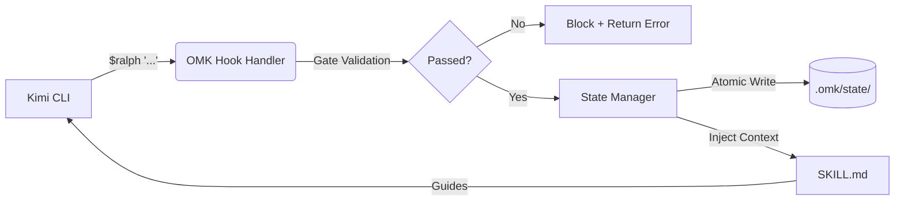

<div align="center">


# 🚀 oh-my-kimi (OMK)

**The Ultimate Workflow Orchestration Layer for [Kimi Code CLI](https://moonshotai.github.io/kimi-cli/)**

[](https://github.com/Goblin1024/oh-my-kimi/actions/workflows/ci.yml)
[](https://www.npmjs.com/package/oh-my-kimi-cli)
[](https://github.com/Goblin1024/oh-my-kimi/blob/main/LICENSE)
[](https://github.com/Goblin1024/oh-my-kimi/stargagers)
[](http://makeapullrequest.com)

*Turn Kimi Code CLI from a conversational assistant into a structured engineering platform.*

[English](./README.md) • [简体中文](./README.zh-CN.md) • [Documentation](docs/GETTING-STARTED.md)

</div>

---

## 🎯 The Problem

[Kimi Code CLI](https://moonshotai.github.io/kimi-cli/) is a powerful **general-purpose execution engine**. It can read code, run shell commands, spawn subagents, and plan autonomously. But when you use it for real software development, you quickly hit friction:

| Pain Point | What Happens |
|------------|--------------|
| **No structured process** | You jump straight into coding without clarifying requirements or designing architecture. Refactoring later costs 3× the time. |
| **Session amnesia** | Every `kimi` launch starts from zero. There's no memory of the plan you approved yesterday or the bug you were halfway through fixing. |
| **Prompt-level discipline only** | Skills are just markdown files. The AI is supposed to "self-discipline" and follow them—except it often doesn't. |
| **Phantom completion** | The agent says "tests pass" but never actually ran them. You discover broken builds only after the session ends. |
| **Black-box token spend** | You have no idea how many tokens a task consumed, no budget guardrails, and no way to optimize. |
| **No quality gates** | The same agent that wrote the code approves it. Security-sensitive changes go unreviewed. |
| **Parallel chaos** | `Agent()` spawns workers, but there's no slot management, no inter-worker messaging, and no consolidated oversight. |

**OMK solves all of these**—not with better prompts, but with a **code-level workflow engine** that sits between you and Kimi.

---

## ✨ What OMK Adds to Kimi CLI

| Dimension | Kimi CLI Alone | **Kimi CLI + OMK** |
|-----------|---------------|-------------------|
| **Development Flow** | Ad-hoc conversation | `$deep-interview` → `$ralplan` → `$ralph` structured pipeline |
| **State Persistence** | Session is forgotten on exit | Atomic state in `.omk/state/`; resume with `$ralph "continue"` |
| **Constraint Enforcement** | "Please follow the skill" (prompt-level) | Code-enforced gates block invalid activations before Kimi even starts |
| **Completion Verification** | Agent self-declares "done" | Evidence required: test output, build log, lint result, architect sign-off |
| **Token Control** | Black-box consumption | Per-skill budgets, complexity routing, real-time HUD tracker |
| **Quality Assurance** | No review mechanism | Cross-validation network: architect→critic, impl→reviewer, auth→security |
| **Parallel Execution** | Raw `Agent()` calls | Team runtime with slot limits, mailbox messaging, heartbeat monitoring |
| **Observability** | Blind wait for output | Live HUD dashboard: workflow phase, worker status, token burn rate |
| **Long-Term Memory** | None | BM25 semantic search across project memory via MemPalace bridge |
| **Agent Roles** | Manual configuration | 28 pre-defined roles with token budgets, tool restrictions, and step limits |

> **In one sentence:** OMK doesn't replace Kimi. It upgrades Kimi from a **chatbot that codes** to a **software engineering team that executes with process, evidence, and oversight.**

---

## ⚡ Quick Start

### 1. Installation

Requires Node.js 20+ and [Kimi CLI](https://moonshotai.github.io/kimi-cli/) installed.

```bash
npm install -g oh-my-kimi-cli
omk setup
```

### 2. Natural Language (No Commands Required)

OMK's **Smart Auto-Orchestrator** detects your intent automatically:

```bash
kimi
```

Then simply describe what you need in natural language:

```bash
# OMK automatically detects this as requirement-gathering and activates $deep-interview
"I want to build a secure authentication system with OAuth and MFA"

# OMK detects architecture-design intent and activates $ralplan
"Design the database schema and API endpoints for the auth system"

# OMK detects implementation intent and activates $ralph
"Implement the approved authentication system with unit tests"

# Complex tasks automatically trigger team mode
"Build a full-stack e-commerce app with React frontend and Node.js backend"
```

### 3. Explicit Commands (When You Know Exactly What You Want)

For precise control, use explicit skill commands:

```bash
# Stage 1: Clarify requirements via Socratic questioning
$deep-interview "I want to build a secure authentication system"

# Stage 2: Design architecture and get user approval
$ralplan "Draft the implementation plan for the auth system"

# Stage 3: Execute with persistence until fully verified
$ralph "Implement the approved plan"
```

---

## 🛠️ Built-in Skills

| Command | Description | Best Used When... |
| :--- | :--- | :--- |
| 🕵️‍♂️ `$deep-interview` | Socratic requirements gathering | The feature is vague, or boundaries need clarifying |
| 📐 `$ralplan` | Architecture planning & approval | You need a solid, reviewed plan before coding starts |
| 🏃‍♂️ `$ralph` | Persistence loop to completion | It's time to write code, test, and verify against the plan |
| 👥 `$team` | Parallel multi-agent execution | A task can be broken into independent sub-tasks |
| 🛑 `$cancel` | Graceful workflow abort | You need to stop the current agentic process |

---

## 🏗️ Core Systems

### 1. Workflow Orchestration

OMK provides a **code-enforced development pipeline** that guides Kimi through the same stages human teams use:

- **`$deep-interview`** — Locks down goals, scope, constraints, and risks before any code is written
- **`$ralplan`** — Generates an architecture PRD and blocks execution until the user explicitly approves it
- **`$ralph`** — Iterates until completion, requiring machine-checkable evidence at every gate

State transitions are validated by `assertValidTransition()`. You cannot jump from "planning" to "complete" without passing through verification.

### 2. Gate & Flag Validation

Skills declare their constraints in YAML frontmatter. OMK enforces them in code **before** Kimi receives the prompt:

```yaml
gates:
  - type: prompt_specificity      # Blocks vague prompts
    blocking: true
  - type: has_active_plan         # Blocks $ralph without approved PRD
    blocking: true
  - type: no_shortcut_keywords    # Warns on "just", "simply", "quickly"
    blocking: false
```

Flags like `--deliberate` or `--eco` are validated against the manifest. Unknown flags are rejected with a helpful error.

### 3. Evidence-Based Verification

"The task is not complete until verification proves it."

`$ralph` requires five categories of evidence before marking complete:

| Evidence Type | Example |
|---------------|---------|
| `command_output` | `npm test` exit code 0 |
| `file_artifact` | Generated source files |
| `review_signature` | Architect subagent approval |
| `diff_record` | Lines added/removed |
| `context_record` | Decision rationale |

Phase transitions throw `TransitionBlockedError` if required evidence is missing. No more "it should work"—prove it works.

### 4. Token Efficiency System

Token usage is tracked, budgeted, and optimized per skill session:

- **Budgets per skill**: `deep-interview` 16K, `ralph` 32K, `autopilot` 128K
- **Flag multipliers**: `--eco` 0.25×, `--quick` 0.5×, `--deliberate` 4×
- **Complexity router**: Low-complexity tasks (reviews, searches) get low-cost configs; architecture work gets frontier models
- **Evidence pruner**: Compresses evidence >5KB to reclaim tokens
- **HUD panel**: Real-time progress bar, remaining tokens, efficiency score

### 5. Cross-Validation Network

> *No agent approves its own work.*

| Rule | Trigger | Required Reviewer |
|------|---------|-------------------|
| `architect_output` | Any architectural decision | `critic` |
| `implementation` | Code changes | `test-engineer` or `code-reviewer` |
| `security_touch` | File path matches `/auth\|password\|token\|secret/` | `security-reviewer` |
| `large_change` | >100 lines added+removed | `architect` |

### 6. Team Runtime

Launch N parallel Kimi workers with `$team N`:

- **Slot Manager** — Respects `max_running_tasks` from `~/.kimi/config.toml`
- **Mailbox** — File-based JSONL messaging between workers
- **KimiRuntime** — Spawns real `kimi` processes with heartbeat + auto-restart (max 3)
- **Log isolation** — Each worker writes to `.omk/logs/team/latest/w{N}.log`

### 7. Semantic Memory & HUD

- **BM25 Memory Bridge** — Integrates with MemPalace for ranked semantic search across project history (falls back gracefully if not installed)
- **Event-Driven HUD** — `omk hud` opens a live terminal dashboard using `fs.watch` (100ms debounce). Monitors workflow phase, team worker status, and token burn rate in real time.

### 8. Agent Ecosystem

28 pre-defined agent roles, each with a calibrated token budget, reasoning effort, and tool restriction profile:

| Role | Budget | Tools | Purpose |
|------|--------|-------|---------|
| `architect` | 128K | all | System design, long-horizon tradeoffs |
| `executor` | 64K | read/search/edit/write/execute | Code implementation |
| `security-reviewer` | 64K | read/search/execute | Vulnerability audit |
| `style-reviewer` | 8K | read only | Formatting & naming conventions |

TOML configs are auto-generated with `# omk:` metadata for native Kimi Agent compatibility.

---

## ⚙️ How It Works Under the Hood

OMK integrates natively via Kimi's hook system:



1. **Hook Interception** — Kimi `UserPromptSubmit` event triggers the OMK handler
2. **Gate Enforcement** — Code validates flags, prompt specificity, and workflow preconditions
3. **State Tracking** — Atomic file writes guarantee concurrent-safe state persistence
4. **Skill Injection** — The matching `SKILL.md` manifest is loaded into Kimi's context
5. **Autonomous Execution** — Kimi follows the structured workflow, submitting evidence via MCP tools
6. **Cross-Validation** — Critical outputs are reviewed by independent agent roles before acceptance

---

## 🖥️ CLI Commands

```bash
omk setup              # Install skills, configure hooks, register MCP servers
omk doctor             # Health checks + version integrity + handler SHA-256 verification
omk update             # Check npm registry for newer versions
omk uninstall          # Safely remove hooks (backs up config.toml) and skills
omk hud                # Live terminal dashboard
omk explore "auth"     # Search codebase respecting .gitignore
omk team 3:executor "task"   # Launch 3 parallel workers
omk mcp state          # Start the state MCP server
omk mcp memory         # Start the memory MCP server
```

---

## 📚 Documentation

*   📖 [Getting Started Guide](docs/GETTING-STARTED.md)
*   💡 [Real-World Examples](docs/EXAMPLES.md)
*   🏗️ [Architecture Deep Dive](docs/ARCHITECTURE.md)
*   🤖 [Agent System Guidance](docs/AGENTS.md)
*   🔄 [Workflow Manual](docs/WORKFLOW.md)
*   ✅ [Verification & Testing](VERIFICATION.md)

---

## 🤝 Contributing & Community

We believe in open collaboration!

*   Want to add a new skill? Fix a bug? Read our [Contributing Guidelines](CONTRIBUTING.md).
*   Run the test suite locally: `npm run test:all`.

### Meet the Team

| Role | Name | GitHub |
| :--- | :--- | :--- |
| Creator & Lead | SpiritPunch | [@Goblin1024](https://github.com/Goblin1024) |

### Acknowledgments

Built with inspiration from the phenomenal [oh-my-codex](https://github.com/Yeachan-Heo/oh-my-codex) by Yeachan Heo. OMK reimagines these concepts tailored specifically for the Kimi ecosystem.

This project also draws architectural and design inspiration from [oh-my-claudecode](https://github.com/Yeachan-Heo/oh-my-claudecode) (OMC), the groundbreaking multi-agent orchestration layer for Claude Code. While OMK is an independent implementation for the Kimi ecosystem, we are deeply grateful to the OMC project for pioneering many of the workflow patterns and agentic concepts that inspired our approach.

---

<div align="center">
  <i>Made with ❤️ for the Kimi CLI community</i><br>
  <b>MIT License © SpiritPunch</b>
</div>
