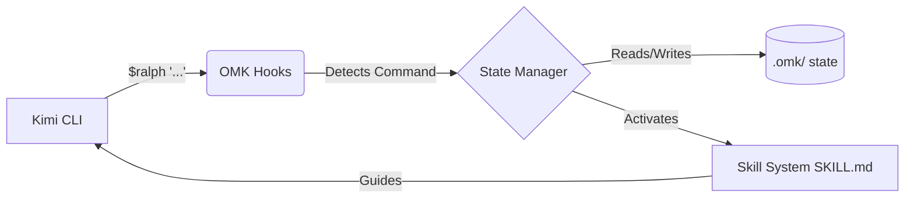

<div align="center">


# 🚀 oh-my-kimi (OMK)

**The Ultimate Workflow Orchestration Layer for [Kimi Code CLI](https://moonshotai.github.io/kimi-cli/)**

[](https://github.com/Goblin1024/oh-my-kimi/actions/workflows/ci.yml)
[](https://www.npmjs.com/package/oh-my-kimi)
[](https://github.com/Goblin1024/oh-my-kimi/blob/main/LICENSE)
[](https://github.com/Goblin1024/oh-my-kimi/stargazers)
[](http://makeapullrequest.com)

*Bring structured agentic workflows, team collaboration, and persistent execution to your AI coding sessions.*

[English](./README.md) • [简体中文](./README.zh-CN.md) • [Documentation](docs/GETTING-STARTED.md)

</div>

---

## ✨ Why oh-my-kimi?

**oh-my-kimi (OMK)** supercharges your [Kimi Code CLI](https://moonshotai.github.io/kimi-cli/) experience. While Kimi serves as a powerful execution engine, OMK adds the missing layer of **structured workflows, intelligent state management, and reusable agent skills**.

Stop prompting from scratch every time. Start building with a proven system.

### 🌟 What Makes OMK Different

Unlike plain prompt templates, OMK is a **code-level workflow engine**:

- 🛡️ **Code-Enforced Gates:** Flags and preconditions are validated by code, not just documented.
- 🔒 **Atomic State Management:** Concurrent-safe file operations with spin-locks prevent state corruption.
- 📡 **Event-Driven HUD:** Real-time terminal dashboard using `fs.watch` instead of wasteful polling.
- 🔍 **Semantic Memory:** BM25-powered memory retrieval instead of naive string matching.
- 🧩 **Dynamic Skill Discovery:** Skills are parsed from YAML frontmatter at runtime—no hardcoding required.

---

## ⚡ Quick Start

### 1. Installation

Ensure you have Node.js 20+ and [Kimi CLI](https://moonshotai.github.io/kimi-cli/) installed.

```bash
npm install -g oh-my-kimi
omk setup
```

### 2. The Canonical Workflow

Fire up Kimi and experience structured AI development:

```bash
kimi
```

Then, use the built-in commands:

```bash
# 1. Clarify requirements (Socratic questioning)
$deep-interview "I want to build a secure authentication system"

# 2. Design the architecture (Review & Approve)
$ralplan "Draft the implementation plan for the auth system"

# 3. Execute with persistence (Loop until done)
$ralph "Implement the approved plan"
```

---

## 🛠️ Built-in Skills

| Command | Description | Best Used When... |
| :--- | :--- | :--- |
| 🕵️‍♂️ `$deep-interview` | Socratic requirements gathering | The feature is vague, or boundaries need clarifying. |
| 📐 `$ralplan` | Architecture planning & approval | You need a solid, reviewed plan before coding starts. |
| 🏃‍♂️ `$ralph` | Persistence loop to completion | It's time to write code, test, and verify against the plan. |
| 👥 `$team` | Parallel multi-agent execution | A task can be broken into independent sub-tasks. |
| 🛑 `$cancel` | Graceful workflow abort | You need to stop the current agentic process. |

---

## 🏗️ Architecture & Core Features

### 1. Concurrent-Safe State Management

All state writes use **atomic rename** (`write-to-temp-then-rename`) so concurrent hook invocations or HUD polling can never observe partially-written JSON.

- `src/state/atomic.ts` — `writeAtomic()` + `withFileLock()` (spin-lock with stale detection)
- `src/team/state.ts` — `updateWorkerState()` serializes concurrent worker exit events

### 2. Skill Manifest Parser & Code-Enforced Validation

Skills are no longer opaque markdown. OMK parses YAML frontmatter from `SKILL.md` at runtime:

```yaml
---
name: ralplan
trigger: $ralplan
flags:
  - name: --deliberate
    description: Enable extended multi-round review
phases:
  - starting
  - planning
  - deliberating
  - reviewing
  - approved
gates:
  - type: prompt_specificity
    description: Task description must be at least 10 characters
    blocking: true
---
```

**Code-enforced gates** (not just documentation):
- `prompt_specificity` — blocks vague prompts
- `has_active_plan` — blocks execution without an approved plan
- `workflow_not_active` — prevents concurrent workflow collisions
- `custom` — regex-based predicate matching

### 3. Per-Skill Workflow State Machine

The global phase transition matrix is enhanced with **per-skill custom phases** loaded from manifests. A skill declaring its own `phases:` gets a linear transition graph enforced by `assertValidTransition()`.

### 4. Team Runtime with Worker Logging

```bash
omk team 3:executor "refactor the auth module"
omk team logs w1        # view individual worker log
omk team shutdown       # terminate all workers
```

Worker stdout/stderr is piped to both the terminal and `.omk/logs/team/latest/{workerId}.log`.

### 5. BM25 Semantic Memory

The MCP Memory Server no longer does naive `String.prototype.includes()`. It uses a **pure-JS BM25 implementation** for ranked relevance search across cross-session project memory.

- `src/utils/bm25.ts` — lightweight BM25 with TF-IDF scoring
- Automatic 90-day retention cleanup

### 6. Event-Driven HUD

```bash
omk hud
```

- Uses `fs.watch` with 100ms debounce instead of 2-second polling
- Displays **Workflow Status** + **Team Status** panels
- Auto-refreshes on state file changes

### 7. MCP Servers

OMK exposes two MCP servers for deep Kimi integration:

- **`omk mcp state`** — `omk_read_state`, `omk_write_state` (validates transitions), `omk_list_skills`
- **`omk mcp memory`** — `omk_memory_store`, `omk_memory_query` (BM25-ranked), `omk_memory_list`

### 8. Structured Observability

- **`src/utils/logger.ts`** —分级日志（debug/info/warn/error）写入 `.omk/logs/system.log`
- **`src/utils/audit.ts`** — Hook 执行审计（JSONL，按天轮转，5MB 上限）
- Every hook invocation records event, skill, duration, and success/failure

### 9. CLI Lifecycle Management

```bash
omk setup        # Install skills, configure hooks, write integrity hash
omk doctor       # Health checks + version integrity + handler SHA-256 verification
omk update       # Check npm registry for newer versions
omk uninstall    # Safely remove hooks (backs up config.toml) and skills
omk explore "auth" [--regex]   # Search codebase respecting .gitignore
omk hud          # Live terminal dashboard
omk team ...     # Parallel agent orchestration
```

---

## ⚙️ How It Works Under the Hood

OMK seamlessly integrates using Kimi's native hooks:



1.  **Hook Interception:** Native Kimi hooks detect your `$command`.
2.  **Gate Enforcement:** Code-level flag/gate validation blocks invalid activations.
3.  **State Tracking:** Atomic workflow state management in `.omk/state/`.
4.  **Skill Injection:** The corresponding `SKILL.md` manifest is loaded into context.
5.  **Autonomous Execution:** Kimi follows the structured guidance to complete your task.

---

## 📚 Documentation

Dive deeper into what makes OMK tick:

*   📖 [Getting Started Guide](docs/GETTING-STARTED.md)
*   💡 [Real-World Examples](docs/EXAMPLES.md)
*   🏗️ [Architecture Deep Dive](docs/ARCHITECTURE.md)
*   🤖 [Agent System Guidance](docs/AGENTS.md)
*   ✅ [Verification & Testing](VERIFICATION.md)

---

## 🤝 Contributing & Community

We believe in open collaboration!

*   Want to add a new skill? Fix a bug? Read our [Contributing Guidelines](CONTRIBUTING.md).
*   Run the test suite locally: `npm run test:all`.

### Meet the Team

| Role | Name | GitHub |
| :--- | :--- | :--- |
| Creator & Lead | SpiritPunch | [@Goblin1024](https://github.com/Goblin1024) |

### Acknowledgments

Built with inspiration from the phenomenal [oh-my-codex](https://github.com/Yeachan-Heo/oh-my-codex) by Yeachan Heo. OMK reimagines these concepts tailored specifically for the Kimi ecosystem.

---

<div align="center">
  <i>Made with ❤️ for the Kimi CLI community</i><br>
  <b>MIT License © SpiritPunch</b>
</div>
